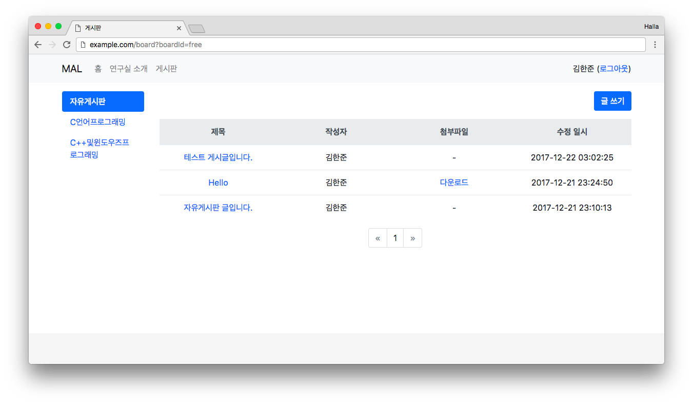

# SimpleBoard



## Installation

Clone this repository and run `up.sh`, which will pull the docker images(`hallazzang/simpleboard`, `mysql`, `adminer`)
and run the stack in detached mode.

```bash
$ ./up.sh
```

You can visit the site on `localhost:8888`.

## Create New Board

At the first time you run it, there is no auto-generated board thus it'll show `404 Not Found` page
when you try to visit `:8888/board`. To fix this, you should create a board manually. Here's how you can do:

1. Visit `localhost:8081`, you can see Adminer interface.
2. Select **MySQL**(which is default) for **System** and type `mysql` in **Server** and `simpleboard` for all other fields.
3. Click **boards** on the left side.
4. Click **New item** and create new board.

Later, you should delete `adminer` service from your stack - edit `docker/compose.yml`.

## Project Structure

```
.
├── README.md
├── SimpleBoard.iml
├── dbschema.sql
├── dockerize.sh
├── up.sh
├── down.sh
├── mysqld.cnf
├── lib                            // common libraries(mysql driver, apache httpclient, cos, ...)
│   └── *.jar
├── public                         // public assets
│   ├── css
│   │   └── *.css
│   └── js
│       └── *.js
├── src                            // servlets(controllers), DAOs, DTOs, utility clasees
│   └── simpleboard
│       ├── common
│       │   └── *.java
│       ├── controller
│       │   └── *.java
│       ├── dao
│       │   └── *.java
│       └── dto
│           └── *.java
└── web                            // jsp views
    ├── common/                    // commonly used components
    │   └── *.jsp
    └── *.jsp
```
